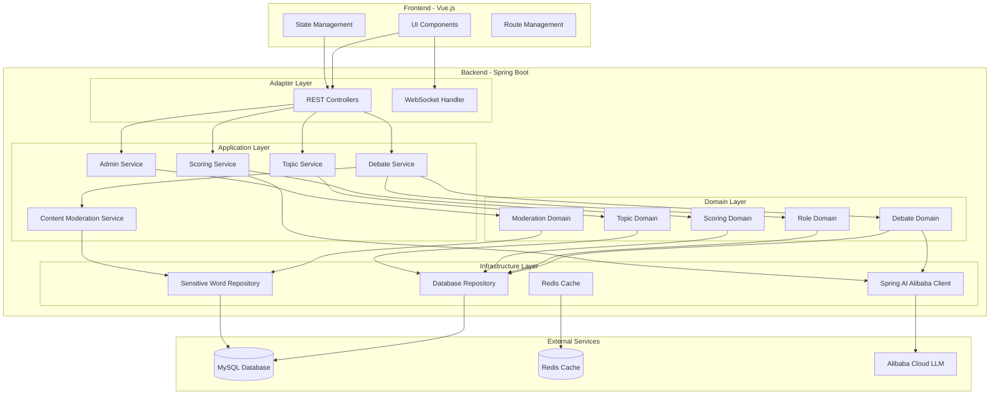
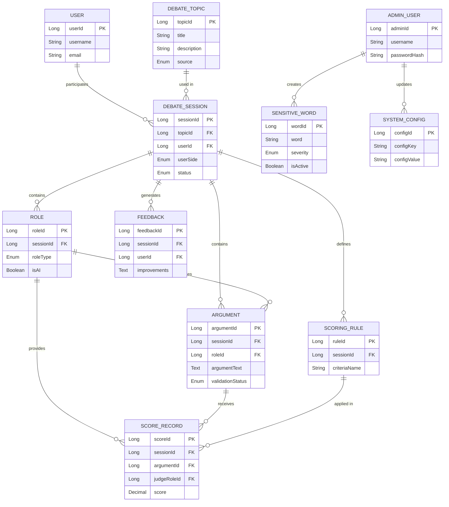
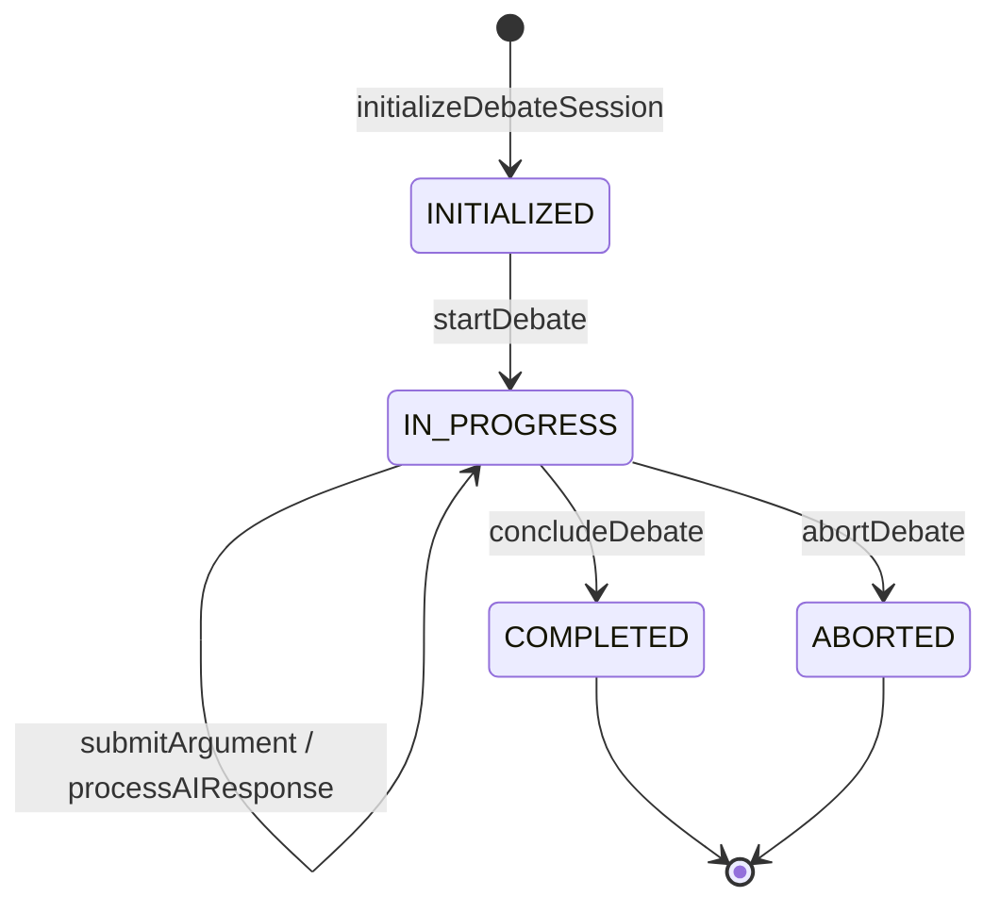
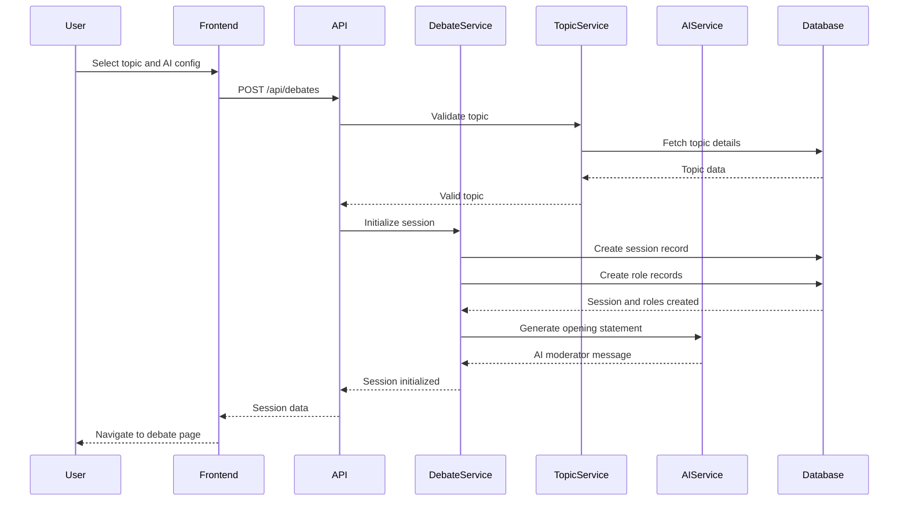
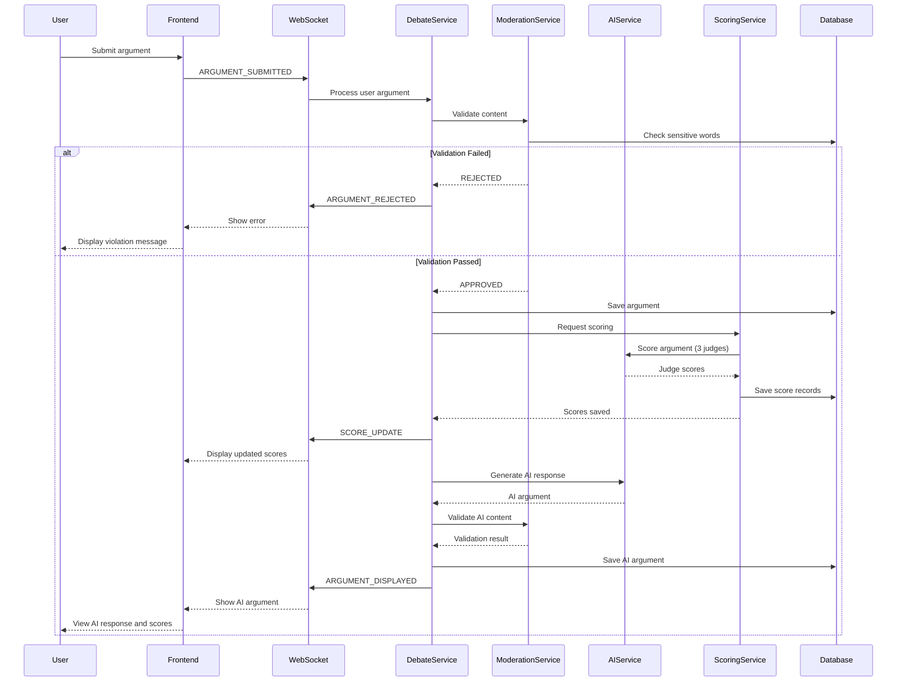

# AI Debate Simulator - Requirement Analysis and Design

## 1. Project Overview

### 1.1 Project Vision
Develop an AI-powered debate simulation platform that enables users to practice and improve their debate skills in a safe, convenient environment without requiring human opponents.

### 1.2 Target Users
- Students
- Debate enthusiasts
- Speech trainers
- Educators

### 1.3 Core Value Proposition
Provide high-quality debate training through AI-driven opponents, real-time feedback, and intelligent scoring to enhance users' logical thinking, expression abilities, and debate techniques.

---

## 2. Requirements Analysis

### 2.1 Functional Requirements

#### 2.1.1 Debate Topic Management
- **Hot Topic Generation**: System automatically generates debate topics based on current trending issues
- **Custom Topic Input**: Users can input custom debate topics
- **AI Topic Generation**: AI generates debate topics based on user input parameters

#### 2.1.2 Role System
The application involves five distinct role types:

| Role | Type | Responsibilities |
|------|------|------------------|
| Organizer | AI-driven | Define debate process and scoring rules |
| Moderator | AI-driven | Announce rules, manage debate flow, declare results based on judge scores |
| Affirmative Side | User/AI | Argue for the motion |
| Negative Side | User/AI | Argue against the motion |
| Judges (3) | AI-driven | Independently score debaters based on established criteria |

#### 2.1.3 User Participation Flow
- User selects their side (Affirmative or Negative)
- AI automatically becomes the opponent
- User can preview AI-generated content for their arguments before submission
- Users can regenerate preview content multiple times until satisfied

#### 2.1.4 AI Opponent Configuration
- Personality settings (aggressive, calm, analytical, etc.)
- Professional level settings (beginner, intermediate, expert)
- Debate style customization

#### 2.1.5 Real-time Debate Interaction
- Turn-based argument exchange
- Real-time dialogue display
- Viewpoint confrontation tracking

#### 2.1.6 Intelligent Scoring System
- Logic analysis
- Persuasiveness evaluation
- Expression fluency assessment
- Targeted improvement suggestions
- Real-time score display

#### 2.1.7 Backend Management Module
- User debate record management
- Debate history viewing
- Statistical analysis of user performance
- Default credentials: username=admin, password=admin
- Sensitive word dictionary management
- Sensitive word validation toggle (enable/disable)

#### 2.1.8 Content Moderation System
- **Sensitive Word Dictionary**: Maintain a configurable list of sensitive/inappropriate words
- **Content Validation**: Validate user input and AI-generated content against sensitive word dictionary
- **Admin Control**: Enable or disable sensitive word validation through admin backend
- **Violation Handling**: Block or flag content containing sensitive words
- **Dictionary Management**: Add, remove, and update sensitive words through admin interface

### 2.2 Non-Functional Requirements

#### 2.2.1 User Interface Style
- **Theme**: Wasteland style (post-apocalyptic aesthetic)
- **Color Scheme**: Deep blue and gold as primary colors to create professional debate atmosphere
- **Layout**: Split-screen debate stage
  - Left side: User arguments
  - Right side: AI arguments
  - Top: Timer and score display
- **Copy Tone**: Formal, encouraging, with slight competitive edge

#### 2.2.2 Interaction Design
- Dual input modes: Text typing and voice input
- Real-time character count display
- Responsive feedback

#### 2.2.3 Technical Stack

| Layer | Technology | Details |
|-------|-----------|---------|
| Frontend | Vue.js + Tailwind CSS | Modern reactive UI framework with utility-first CSS |
| Backend | Java + Spring Boot | JDK 21, Maven dependency management |
| Architecture | COLA 4 | Clean Object-oriented and Layered Architecture |
| Database | MySQL + MyBatis Plus | ORM framework for data persistence |
| Cache | Redis | Distributed caching (if needed) |
| AI Integration | Spring AI Alibaba | Integration with Alibaba Cloud LLM services |
| Third-party Libraries | Google Guava, Apache Commons | Priority on these open-source packages |

#### 2.2.4 Project Structure
- Monolithic architecture (frontend and backend in same project)
- Configuration-driven (no hard-coded values)

#### 2.2.5 Database Configuration
- Connection: localhost:3306
- Database name: aidebate
- SQL scripts included in project for manual database/table creation

#### 2.2.6 Quality Requirements
- Unit tests for all domain layer services
- Code standards: Alibaba Java Development Manual (Huangshan Edition)

---

## 3. Scrum Story and Task Breakdown

### Epic 1: Core Debate System

#### Story 1.1: Debate Topic Management
**As a** user  
**I want to** select or create debate topics  
**So that** I can practice debates on subjects I'm interested in

**Acceptance Criteria:**
- Hot topics are automatically generated and displayed
- Users can input custom topics
- AI can generate topics based on user keywords

**Tasks:**
- Task 1.1.1: Design topic entity model and database schema
- Task 1.1.2: Implement hot topic generation service (AI integration)
- Task 1.1.3: Implement custom topic creation API
- Task 1.1.4: Implement AI topic suggestion service
- Task 1.1.5: Create topic selection UI component
- Task 1.1.6: Write unit tests for topic services

**Estimation:** 8 Story Points

---

#### Story 1.2: Role and Debate Flow Management
**As a** system  
**I want to** manage all debate roles and their interactions  
**So that** the debate follows proper structure and rules

**Acceptance Criteria:**
- System creates Organizer, Moderator, and 3 Judges as AI entities
- User can select Affirmative or Negative side
- AI opponent is automatically assigned
- Debate flow follows proper sequence

**Tasks:**
- Task 1.2.1: Design role entity models and relationships
- Task 1.2.2: Implement debate session management service
- Task 1.2.3: Implement role assignment logic
- Task 1.2.4: Implement debate flow state machine
- Task 1.2.5: Create debate initialization API
- Task 1.2.6: Write unit tests for role and flow services

**Estimation:** 13 Story Points

---

#### Story 1.3: AI Opponent System
**As a** user  
**I want to** configure AI opponent characteristics  
**So that** I can practice against different debate styles

**Acceptance Criteria:**
- AI personality can be selected (multiple options)
- AI professional level can be adjusted
- AI generates contextually appropriate arguments
- AI responses are coherent and relevant

**Tasks:**
- Task 1.3.1: Design AI configuration entity model
- Task 1.3.2: Implement AI prompt engineering service
- Task 1.3.3: Integrate with AI model API (LLM integration)
- Task 1.3.4: Implement personality and level parameter mapping
- Task 1.3.5: Create AI configuration UI
- Task 1.3.6: Write unit tests for AI configuration service

**Estimation:** 13 Story Points

---

#### Story 1.4: Debate Argument Exchange
**As a** user  
**I want to** exchange arguments with AI opponent in real-time  
**So that** I can practice debate skills

**Acceptance Criteria:**
- Users can input text or voice
- AI generates preview content for user arguments
- Users can regenerate previews multiple times
- Users can submit final argument
- AI opponent responds appropriately
- Real-time character count displayed

**Tasks:**
- Task 1.4.1: Design argument entity model and database schema
- Task 1.4.2: Implement argument submission API
- Task 1.4.3: Implement AI preview generation service
- Task 1.4.4: Implement voice input integration (if applicable)
- Task 1.4.5: Create split-screen debate UI
- Task 1.4.6: Implement real-time character counter
- Task 1.4.7: Implement argument display with timer
- Task 1.4.8: Write unit tests for argument services

**Estimation:** 13 Story Points

---

### Epic 2: Intelligent Scoring System

#### Story 2.1: Judge Scoring Mechanism
**As a** judge AI  
**I want to** evaluate debater performance based on criteria  
**So that** fair and objective scores are provided

**Acceptance Criteria:**
- 3 independent judges score each argument
- Scoring criteria include: logic, persuasiveness, fluency
- Scores are displayed in real-time
- Final scores determine winner

**Tasks:**
- Task 2.1.1: Design scoring rule entity model
- Task 2.1.2: Design score record entity model and database schema
- Task 2.1.3: Implement scoring criteria definition service
- Task 2.1.4: Implement judge AI scoring service
- Task 2.1.5: Implement score aggregation logic
- Task 2.1.6: Create real-time score display UI
- Task 2.1.7: Write unit tests for scoring services

**Estimation:** 13 Story Points

---

#### Story 2.2: Performance Analysis and Feedback
**As a** user  
**I want to** receive detailed feedback on my debate performance  
**So that** I can identify areas for improvement

**Acceptance Criteria:**
- System analyzes logic quality
- System evaluates persuasiveness
- System assesses expression fluency
- Targeted improvement suggestions provided
- Historical performance tracking available

**Tasks:**
- Task 2.2.1: Design feedback entity model
- Task 2.2.2: Implement logic analysis service (AI-powered)
- Task 2.2.3: Implement persuasiveness evaluation service
- Task 2.2.4: Implement fluency assessment service
- Task 2.2.5: Implement suggestion generation service
- Task 2.2.6: Create performance feedback UI
- Task 2.2.7: Write unit tests for analysis services

**Estimation:** 13 Story Points

---

### Epic 3: Backend Management System

#### Story 3.1: Admin Authentication
**As an** administrator  
**I want to** log in to the backend management system  
**So that** I can manage debate records and view analytics

**Acceptance Criteria:**
- Login with username: admin, password: admin
- Session management
- Access control for admin routes

**Tasks:**
- Task 3.1.1: Design admin user entity model
- Task 3.1.2: Implement authentication service
- Task 3.1.3: Implement session management
- Task 3.1.4: Create login API
- Task 3.1.5: Create admin login UI
- Task 3.1.6: Write unit tests for authentication service

**Estimation:** 5 Story Points

---

#### Story 3.2: Debate Record Management
**As an** administrator  
**I want to** view and manage all debate records  
**So that** I can monitor system usage and user activity

**Acceptance Criteria:**
- List all debate sessions with pagination
- View detailed debate transcripts
- Filter and search debates
- Export debate data

**Tasks:**
- Task 3.2.1: Implement debate record query service
- Task 3.2.2: Implement pagination and filtering logic
- Task 3.2.3: Create debate list API
- Task 3.2.4: Create debate detail API
- Task 3.2.5: Create debate management UI
- Task 3.2.6: Write unit tests for record management services

**Estimation:** 8 Story Points

---

#### Story 3.3: Statistical Analysis Dashboard
**As an** administrator  
**I want to** view statistical analysis of user debates  
**So that** I can understand platform usage patterns

**Acceptance Criteria:**
- Display total debate count
- Show user participation statistics
- Display average scores and trends
- Visualize popular topics

**Tasks:**
- Task 3.3.1: Design statistics aggregation models
- Task 3.3.2: Implement statistics calculation service
- Task 3.3.3: Implement caching for statistics (Redis)
- Task 3.3.4: Create statistics API
- Task 3.3.5: Create dashboard UI with charts
- Task 3.3.6: Write unit tests for statistics services

**Estimation:** 8 Story Points

---

#### Story 3.4: Sensitive Word Management and Content Moderation
**As an** administrator  
**I want to** manage sensitive word dictionary and control content validation  
**So that** the platform maintains appropriate content standards

**Acceptance Criteria:**
- Admin can add, edit, and delete sensitive words
- Admin can enable or disable sensitive word validation
- User input is validated against sensitive word dictionary when enabled
- AI-generated content is validated against sensitive word dictionary when enabled
- Violations are properly flagged or blocked
- Validation status is configurable per session or globally

**Tasks:**
- Task 3.4.1: Design sensitive word entity model and database schema
- Task 3.4.2: Implement sensitive word dictionary CRUD service
- Task 3.4.3: Implement content validation service with pattern matching
- Task 3.4.4: Implement validation toggle mechanism
- Task 3.4.5: Integrate validation into argument submission flow
- Task 3.4.6: Integrate validation into AI content generation flow
- Task 3.4.7: Create sensitive word management UI
- Task 3.4.8: Create validation toggle UI in admin settings
- Task 3.4.9: Write unit tests for validation services

**Estimation:** 8 Story Points

---

### Epic 4: Foundation and Infrastructure

#### Story 4.1: Project Architecture Setup
**As a** developer  
**I want to** set up the project structure following COLA 4 architecture  
**So that** the codebase is maintainable and scalable

**Tasks:**
- Task 4.1.1: Initialize Maven project with JDK 21
- Task 4.1.2: Configure Spring Boot dependencies
- Task 4.1.3: Set up COLA 4 module structure (adapter, app, domain, infrastructure)
- Task 4.1.4: Configure MyBatis Plus
- Task 4.1.5: Configure Redis (conditional)
- Task 4.1.6: Set up Vue.js and Tailwind CSS
- Task 4.1.7: Configure build pipeline for integrated frontend-backend

**Estimation:** 8 Story Points

---

#### Story 4.2: Database Schema Design
**As a** developer  
**I want to** design and create database schema  
**So that** data can be properly persisted

**Tasks:**
- Task 4.2.1: Design entity relationship diagram
- Task 4.2.2: Create SQL DDL scripts for all tables
- Task 4.2.3: Create database initialization script
- Task 4.2.4: Configure database connection in application properties
- Task 4.2.5: Implement database migration strategy

**Estimation:** 5 Story Points

---

#### Story 4.3: AI Service Integration with Spring AI Alibaba
**As a** developer  
**I want to** integrate with Alibaba Cloud LLM services  
**So that** AI-driven features can function

**Tasks:**
- Task 4.3.1: Configure Spring AI Alibaba dependency in Maven
- Task 4.3.2: Design AI service abstraction layer
- Task 4.3.3: Implement Alibaba Cloud LLM client service
- Task 4.3.4: Configure Alibaba Cloud API credentials in application properties
- Task 4.3.5: Implement retry and error handling
- Task 4.3.6: Write unit tests for AI service integration

**Estimation:** 8 Story Points

---

### Epic 5: UI/UX Implementation

#### Story 5.1: Wasteland Theme Design System
**As a** user  
**I want to** experience a visually cohesive wasteland-themed interface  
**So that** the application is immersive and engaging

**Tasks:**
- Task 5.1.1: Design color palette (deep blue, gold theme)
- Task 5.1.2: Create Tailwind configuration for theme
- Task 5.1.3: Design reusable UI components
- Task 5.1.4: Implement typography system
- Task 5.1.5: Create icon set
- Task 5.1.6: Design responsive layout templates

**Estimation:** 8 Story Points

---

#### Story 5.2: Split-Screen Debate Interface
**As a** user  
**I want to** see my arguments and AI arguments side-by-side  
**So that** I can follow the debate flow easily

**Tasks:**
- Task 5.2.1: Design split-screen layout component
- Task 5.2.2: Implement left panel (user arguments)
- Task 5.2.3: Implement right panel (AI arguments)
- Task 5.2.4: Implement top bar (timer and score)
- Task 5.2.5: Add responsive behavior for mobile devices
- Task 5.2.6: Implement smooth transitions and animations

**Estimation:** 8 Story Points

---

## 4. Sprint Planning Recommendation

### Sprint 1 (2 weeks): Foundation
- Story 4.1: Project Architecture Setup
- Story 4.2: Database Schema Design
- Story 4.3: AI Service Integration with Spring AI Alibaba
- Story 5.1: Wasteland Theme Design System

**Total: 29 Story Points**

---

### Sprint 2 (2 weeks): Core Debate Features
- Story 1.1: Debate Topic Management
- Story 1.2: Role and Debate Flow Management
- Story 3.1: Admin Authentication

**Total: 26 Story Points**

---

### Sprint 3 (2 weeks): AI Integration and Debate Interaction
- Story 1.3: AI Opponent System
- Story 1.4: Debate Argument Exchange
- Story 5.2: Split-Screen Debate Interface

**Total: 34 Story Points**

---

### Sprint 4 (2 weeks): Scoring and Analytics
- Story 2.1: Judge Scoring Mechanism
- Story 2.2: Performance Analysis and Feedback
- Story 3.2: Debate Record Management

**Total: 34 Story Points**

---

### Sprint 5 (2 weeks): Admin Dashboard and Content Moderation
- Story 3.3: Statistical Analysis Dashboard
- Story 3.4: Sensitive Word Management and Content Moderation
- Bug fixes and refinements
- Integration testing

**Total: 16 Story Points**

---

## 5. High-Level Architecture Design

### 5.1 System Architecture Overview

The system follows COLA 4 (Clean Object-oriented and Layered Architecture) with four primary layers:

```
┌─────────────────────────────────────────────────────────────┐
│                      Adapter Layer                          │
│  (Web Controllers, API Endpoints, Frontend Integration)    │
└─────────────────────────────────────────────────────────────┘
                            ↓
┌─────────────────────────────────────────────────────────────┐
│                    Application Layer                        │
│        (Service Orchestration, Use Case Logic)             │
└─────────────────────────────────────────────────────────────┘
                            ↓
┌─────────────────────────────────────────────────────────────┐
│                      Domain Layer                           │
│    (Business Logic, Domain Models, Domain Services)        │
└─────────────────────────────────────────────────────────────┘
                            ↓
┌─────────────────────────────────────────────────────────────┐
│                   Infrastructure Layer                      │
│   (Database Access, External APIs, Redis, File System)     │
└─────────────────────────────────────────────────────────────┘
```

### 5.2 Component Architecture



### 5.3 Technology Stack Mapping

| Layer | Technologies | Purpose |
|-------|-------------|---------|
| Presentation | Vue.js 3, Tailwind CSS | Reactive UI, utility-first styling |
| API | Spring Boot REST, WebSocket | RESTful endpoints, real-time communication |
| Application | Spring Service Layer | Business orchestration |
| Domain | Java POJOs, Domain Services | Core business logic |
| Persistence | MyBatis Plus, MySQL | ORM and data storage |
| Cache | Redis (optional) | Performance optimization |
| AI Integration | Spring AI Alibaba | Alibaba Cloud LLM integration |
| Build | Maven | Dependency management |
| Runtime | JDK 21 | Java runtime environment |

---

## 6. Detailed Design

### 6.1 Domain Model Design

#### 6.1.1 Core Domain Entities

**Debate Topic Entity**

| Attribute | Type | Description | Constraints |
|-----------|------|-------------|-------------|
| topicId | Long | Unique identifier | Primary Key, Auto-increment |
| title | String | Topic title | Not null, max 200 chars |
| description | String | Detailed description | Max 1000 chars |
| source | Enum | HOT_TOPIC, USER_CUSTOM, AI_GENERATED | Not null |
| category | String | Topic category | Max 50 chars |
| createdBy | Long | User who created (nullable for system) | Foreign Key |
| createdAt | Timestamp | Creation time | Not null |
| isActive | Boolean | Active status | Default true |

---

**Debate Session Entity**

| Attribute | Type | Description | Constraints |
|-----------|------|-------------|-------------|
| sessionId | Long | Unique identifier | Primary Key, Auto-increment |
| topicId | Long | Reference to topic | Foreign Key, Not null |
| userId | Long | Participating user | Foreign Key, Not null |
| userSide | Enum | AFFIRMATIVE, NEGATIVE | Not null |
| aiOpponentConfig | JSON | AI personality and level settings | Not null |
| status | Enum | INITIALIZED, IN_PROGRESS, COMPLETED, ABORTED | Not null |
| startedAt | Timestamp | Session start time | Nullable |
| completedAt | Timestamp | Session completion time | Nullable |
| finalScoreUser | Decimal | User's final score | Nullable |
| finalScoreAI | Decimal | AI's final score | Nullable |
| winner | Enum | USER, AI, DRAW | Nullable |

---

**Role Entity**

| Attribute | Type | Description | Constraints |
|-----------|------|-------------|-------------|
| roleId | Long | Unique identifier | Primary Key, Auto-increment |
| sessionId | Long | Reference to debate session | Foreign Key, Not null |
| roleType | Enum | ORGANIZER, MODERATOR, JUDGE_1, JUDGE_2, JUDGE_3, AFFIRMATIVE, NEGATIVE | Not null |
| isAI | Boolean | Whether role is AI-driven | Not null |
| assignedUserId | Long | User assigned to role | Foreign Key, Nullable |
| aiConfig | JSON | AI configuration if applicable | Nullable |

---

**Argument Entity**

| Attribute | Type | Description | Constraints |
|-----------|------|-------------|-------------|
| argumentId | Long | Unique identifier | Primary Key, Auto-increment |
| sessionId | Long | Reference to debate session | Foreign Key, Not null |
| roleId | Long | Role making the argument | Foreign Key, Not null |
| roundNumber | Integer | Debate round number | Not null |
| argumentText | Text | The actual argument content | Not null |
| isPreview | Boolean | Whether this is preview content | Default false |
| submittedAt | Timestamp | Submission time | Not null |
| characterCount | Integer | Number of characters | Not null |
| validationStatus | Enum | PENDING, APPROVED, REJECTED | Default APPROVED |
| validationMessage | String | Reason if rejected | Nullable |

---

**Scoring Rule Entity**

| Attribute | Type | Description | Constraints |
|-----------|------|-------------|-------------|
| ruleId | Long | Unique identifier | Primary Key, Auto-increment |
| sessionId | Long | Reference to debate session | Foreign Key, Not null |
| criteriaName | String | Scoring criterion name | Not null, max 100 chars |
| maxScore | Integer | Maximum possible score | Not null |
| weight | Decimal | Weight in final calculation | Not null, 0-1 |
| description | Text | Criterion description | Nullable |

---

**Score Record Entity**

| Attribute | Type | Description | Constraints |
|-----------|------|-------------|-------------|
| scoreId | Long | Unique identifier | Primary Key, Auto-increment |
| sessionId | Long | Reference to debate session | Foreign Key, Not null |
| argumentId | Long | Reference to argument being scored | Foreign Key, Not null |
| judgeRoleId | Long | Judge providing score | Foreign Key, Not null |
| ruleId | Long | Scoring rule applied | Foreign Key, Not null |
| score | Decimal | Actual score given | Not null |
| feedback | Text | Judge's feedback comments | Nullable |
| scoredAt | Timestamp | Scoring time | Not null |

---

**Feedback Entity**

| Attribute | Type | Description | Constraints |
|-----------|------|-------------|-------------|
| feedbackId | Long | Unique identifier | Primary Key, Auto-increment |
| sessionId | Long | Reference to debate session | Foreign Key, Not null |
| userId | Long | User receiving feedback | Foreign Key, Not null |
| logicScore | Decimal | Logic quality score | Not null |
| persuasivenessScore | Decimal | Persuasiveness score | Not null |
| fluencyScore | Decimal | Fluency score | Not null |
| overallAssessment | Text | General assessment | Not null |
| improvements | JSON | Array of improvement suggestions | Not null |
| generatedAt | Timestamp | Feedback generation time | Not null |

---

**Admin User Entity**

| Attribute | Type | Description | Constraints |
|-----------|------|-------------|-------------|
| adminId | Long | Unique identifier | Primary Key, Auto-increment |
| username | String | Login username | Unique, Not null |
| passwordHash | String | Hashed password | Not null |
| lastLoginAt | Timestamp | Last login time | Nullable |
| createdAt | Timestamp | Account creation time | Not null |

---

**Sensitive Word Entity**

| Attribute | Type | Description | Constraints |
|-----------|------|-------------|-------------|
| wordId | Long | Unique identifier | Primary Key, Auto-increment |
| word | String | Sensitive word or phrase | Unique, Not null, max 100 chars |
| category | String | Word category (profanity, violence, etc.) | Max 50 chars |
| severity | Enum | LOW, MEDIUM, HIGH, CRITICAL | Not null |
| isActive | Boolean | Whether word is currently active | Default true |
| createdBy | Long | Admin who added the word | Foreign Key |
| createdAt | Timestamp | Creation time | Not null |
| updatedAt | Timestamp | Last update time | Not null |

---

**System Configuration Entity**

| Attribute | Type | Description | Constraints |
|-----------|------|-------------|-------------|
| configId | Long | Unique identifier | Primary Key, Auto-increment |
| configKey | String | Configuration key | Unique, Not null |
| configValue | String | Configuration value | Not null |
| description | Text | Configuration description | Nullable |
| updatedBy | Long | Admin who updated | Foreign Key |
| updatedAt | Timestamp | Last update time | Not null |

**Note**: For sensitive word validation toggle, use configKey = "SENSITIVE_WORD_VALIDATION_ENABLED" with configValue = "true" or "false"

---

#### 6.1.2 Domain Relationships



---

### 6.2 Application Service Design

#### 6.2.1 Topic Management Service

**Service Interface: TopicApplicationService**

**Methods:**

| Method | Input | Output | Description |
|--------|-------|--------|-------------|
| generateHotTopics | count: Integer | List of DebateTopic | Generate trending topics using AI |
| createCustomTopic | title, description, userId | DebateTopic | Create user-defined topic |
| generateTopicFromKeywords | keywords: List, userId | DebateTopic | AI generates topic from keywords |
| listActiveTopics | page, size, category | Page of DebateTopic | Retrieve paginated active topics |
| getTopicDetail | topicId | DebateTopic | Get single topic details |

**Business Rules:**
- Hot topics regenerated daily based on current events
- Custom topics validated for appropriate content using sensitive word filter
- AI-generated topics must be reviewed for quality
- Maximum 3 custom topics per user per day

---

#### 6.2.2 Debate Session Management Service

**Service Interface: DebateSessionApplicationService**

**Methods:**

| Method | Input | Output | Description |
|--------|-------|--------|-------------|
| initializeDebateSession | topicId, userId, userSide, aiConfig | DebateSession | Create new debate session |
| startDebate | sessionId | DebateSession | Begin debate with moderator introduction |
| submitArgument | sessionId, roleId, argumentText | Argument | Submit debater's argument (with validation) |
| generatePreviewArgument | sessionId, roleId, context | String | Generate preview for user |
| processAIResponse | sessionId, userArgument | Argument | Generate AI opponent response |
| concludeDebate | sessionId | DebateSession | Finalize debate and calculate winner |
| abortDebate | sessionId, reason | DebateSession | Cancel ongoing debate |

**Debate Flow State Machine:**



**Business Rules:**
- Debate must follow turn-based structure
- Maximum 5 rounds per debate
- Each argument limited to 500 characters
- Time limit of 3 minutes per turn
- Moderator announces rules at start
- Organizer rules applied throughout
- All arguments validated against sensitive word dictionary if enabled

---

#### 6.2.3 AI Opponent Service

**Service Interface: AIOpponentApplicationService**

**Methods:**

| Method | Input | Output | Description |
|--------|-------|--------|-------------|
| configureAIOpponent | personality, professionalLevel, debateStyle | AIConfig | Create AI configuration |
| generateOpponentArgument | sessionContext, userArgument, aiConfig | String | Generate contextual AI argument |
| adjustAIDifficulty | sessionId, newLevel | AIConfig | Dynamically adjust AI difficulty |

**AI Personality Types:**

| Personality | Characteristics | Prompt Strategy |
|-------------|-----------------|-----------------|
| Aggressive | Direct, challenging, uses strong language | Emphasize counterattacks and rebuttals |
| Analytical | Data-driven, logical, methodical | Focus on evidence and structured reasoning |
| Calm | Composed, diplomatic, measured | Balanced tone, respectful disagreement |
| Passionate | Emotional, persuasive, compelling | Use rhetorical devices and appeals |

**Professional Levels:**

| Level | Argumentation Quality | Vocabulary Complexity | Logic Depth |
|-------|----------------------|---------------------|-------------|
| Beginner | Basic points, simple structure | Common words | Surface-level |
| Intermediate | Structured arguments, some evidence | Moderate complexity | Multi-layered |
| Expert | Sophisticated reasoning, extensive evidence | Advanced terminology | Deep analysis |

**Spring AI Alibaba Integration:**
- Use Spring AI Alibaba ChatClient for LLM communication
- Configure Alibaba Cloud API endpoint and credentials
- Implement prompt templates for different AI personalities
- Validate AI-generated content against sensitive words before delivery

---

#### 6.2.4 Scoring Service

**Service Interface: ScoringApplicationService**

**Methods:**

| Method | Input | Output | Description |
|--------|-------|--------|-------------|
| defineScoringRules | sessionId | List of ScoringRule | Create default scoring criteria |
| scoreArgument | argumentId, judgeRoleId | List of ScoreRecord | All judges score an argument |
| calculateRoundScore | sessionId, roundNumber | Map of roleId to score | Aggregate round scores |
| calculateFinalScore | sessionId | Map of roleId to totalScore | Compute final debate scores |
| determineWinner | sessionId | Winner enum | Determine debate winner |

**Default Scoring Criteria:**

| Criterion | Weight | Max Score | Evaluation Focus |
|-----------|--------|-----------|------------------|
| Logic | 0.35 | 10 | Argument structure, reasoning validity, coherence |
| Persuasiveness | 0.35 | 10 | Convincing power, evidence quality, impact |
| Fluency | 0.20 | 10 | Language clarity, grammar, expression smoothness |
| Relevance | 0.10 | 10 | Topic adherence, response appropriateness |

**Scoring Algorithm:**
```
For each argument:
  For each judge (3 judges):
    For each criterion:
      criterionScore = AI evaluates argument against criterion
      weightedScore = criterionScore × criterion.weight
    judgeScore = sum of all weightedScores
  argumentScore = average of all judgeScores

roundScore = sum of all argument scores in round
finalScore = sum of all round scores
```

---

#### 6.2.5 Feedback and Analysis Service

**Service Interface: FeedbackApplicationService**

**Methods:**

| Method | Input | Output | Description |
|--------|-------|--------|-------------|
| analyzeDebatePerformance | sessionId, userId | Feedback | Comprehensive performance analysis |
| generateImprovementSuggestions | feedback | List of Suggestion | Targeted improvement recommendations |
| getPerformanceHistory | userId, timeRange | List of Feedback | Historical performance tracking |
| comparePerformance | userId, sessionId1, sessionId2 | ComparisonReport | Compare two debate performances |

**Analysis Dimensions:**

| Dimension | Analysis Method | Output |
|-----------|----------------|--------|
| Logic Quality | Evaluate argument structure, identify fallacies, assess coherence | Score 0-100, specific weak points |
| Persuasiveness | Measure evidence strength, rhetorical effectiveness | Score 0-100, persuasion techniques used |
| Fluency | Assess grammar, vocabulary richness, readability | Score 0-100, language improvements |
| Improvement Areas | Identify patterns across debates | Prioritized list of focus areas |

---

#### 6.2.6 Admin Management Service

**Service Interface: AdminApplicationService**

**Methods:**

| Method | Input | Output | Description |
|--------|-------|--------|-------------|
| authenticateAdmin | username, password | AuthToken | Login admin user |
| listDebateSessions | page, size, filters | Page of DebateSession | Retrieve debate records |
| getDebateTranscript | sessionId | DebateTranscript | Full debate conversation |
| generateStatistics | timeRange, dimensions | Statistics | Aggregate platform statistics |
| exportDebateData | sessionId, format | File | Export debate data |

**Statistical Metrics:**

| Metric | Calculation | Purpose |
|--------|-------------|---------|
| Total Debates | Count of completed sessions | Platform activity |
| Active Users | Distinct users in time range | User engagement |
| Average User Score | Mean of user final scores | Performance baseline |
| Average AI Score | Mean of AI final scores | Difficulty calibration |
| Popular Topics | Topic frequency distribution | Content insights |
| Win Rate | User wins / total debates | User success tracking |
| Average Debate Duration | Mean session time | Engagement measurement |
| Violations Blocked | Count of sensitive word violations | Content moderation effectiveness |

---

#### 6.2.7 Content Moderation Service

**Service Interface: ContentModerationService**

**Methods:**

| Method | Input | Output | Description |
|--------|-------|--------|-------------|
| validateContent | text | ValidationResult | Check text against sensitive word dictionary |
| addSensitiveWord | word, category, severity | SensitiveWord | Add new sensitive word |
| updateSensitiveWord | wordId, updates | SensitiveWord | Update existing sensitive word |
| deleteSensitiveWord | wordId | Boolean | Remove sensitive word |
| listSensitiveWords | page, size, category | Page of SensitiveWord | List all sensitive words |
| toggleValidation | enabled | SystemConfig | Enable or disable validation globally |
| isValidationEnabled | - | Boolean | Check if validation is currently enabled |

**Validation Algorithm:**
```
1. Check if validation is enabled via system configuration
2. If disabled, return APPROVED status
3. If enabled:
   a. Normalize input text (lowercase, remove special chars)
   b. Retrieve active sensitive words from database/cache
   c. Check for exact matches and pattern matches
   d. If violation found:
      - Return REJECTED status
      - Include matched words and severity
   e. If no violation:
      - Return APPROVED status
```

**Business Rules:**
- Validation can be toggled on/off by admin
- When validation is disabled, all content is auto-approved
- When enabled, user input and AI-generated content are both validated
- Violations block content submission with error message
- Sensitive word dictionary supports wildcards and regex patterns
- Cache sensitive words in Redis for performance

---

### 6.3 Infrastructure Design

#### 6.3.1 Database Repository Design

**Repository Pattern Implementation:**

Each domain entity has a corresponding repository interface defining data access operations:

**TopicRepository Interface:**
- save(topic) - Persist new or update existing topic
- findById(topicId) - Retrieve topic by ID
- findActiveTopics(pageable, category) - Query active topics with pagination
- findBySource(source) - Filter topics by source type

**DebateSessionRepository Interface:**
- save(session) - Persist session
- findById(sessionId) - Retrieve session by ID
- findByUserId(userId, pageable) - User's debate history
- findByStatus(status, pageable) - Filter by session status
- updateStatus(sessionId, newStatus) - Update session status

**ArgumentRepository Interface:**
- save(argument) - Persist argument
- findBySessionId(sessionId) - All arguments in a session
- findByRoleId(roleId) - Arguments by specific role
- findPreviewsBySession(sessionId, roleId) - Retrieve preview arguments

**ScoreRecordRepository Interface:**
- save(scoreRecord) - Persist score
- findByArgumentId(argumentId) - Scores for an argument
- findBySessionId(sessionId) - All scores in a session
- calculateAverageScore(argumentId) - Aggregate scores

**SensitiveWordRepository Interface:**
- save(word) - Persist sensitive word
- findById(wordId) - Retrieve by ID
- findAllActive() - Get all active sensitive words
- findByCategory(category) - Filter by category
- deleteById(wordId) - Remove sensitive word

**SystemConfigRepository Interface:**
- save(config) - Persist configuration
- findByKey(configKey) - Retrieve config by key
- updateValue(configKey, newValue) - Update config value

**MyBatis Plus Configuration:**
- Automatic CRUD generation for basic operations
- Custom query methods using @Select annotations
- Pagination plugin enabled
- Optimistic locking for concurrent updates

---

#### 6.3.2 AI Service Integration Design with Spring AI Alibaba

**Spring AI Alibaba Configuration:**

**Dependencies:**
```
Artifact: spring-ai-alibaba-starter
Purpose: Core Spring AI Alibaba integration
```

**Configuration Parameters:**

| Parameter | Purpose | Location |
|-----------|---------|----------|
| spring.ai.alibaba.api-key | Alibaba Cloud API authentication | application.yml |
| spring.ai.alibaba.base-url | LLM service endpoint | application.yml |
| spring.ai.alibaba.model | Model name (e.g., qwen-turbo, qwen-plus) | application.yml |
| spring.ai.alibaba.timeout | Request timeout in seconds | application.yml |
| spring.ai.alibaba.max-tokens | Maximum response tokens | application.yml |
| spring.ai.alibaba.temperature | Response randomness (0.0-1.0) | application.yml |

**AI Service Abstraction:**

**Interface: AIServiceClient**

**Methods:**

| Method | Input | Output | Description |
|--------|-------|--------|-------------|
| generateText | prompt, config | String | General text generation |
| generateDebateArgument | context, side, config | String | Specialized debate argument |
| scoreArgument | argument, criteria | Map of criterion to score | AI-powered scoring |
| analyzeSentiment | text | SentimentResult | Sentiment analysis |
| generateFeedback | argumentHistory, scores | FeedbackText | Performance feedback generation |

**Implementation Strategy:**
- Use Spring AI Alibaba ChatClient for LLM communication
- Configurable model selection via application properties
- Prompt template management with Spring AI Prompt Templates
- Response validation against sensitive word dictionary
- Rate limiting and quota management
- Fallback mechanisms for service failures
- Circuit breaker pattern for resilience

**Prompt Engineering Patterns:**

**Topic Generation Prompt Template:**
```
Context: Current trending topics in {category}
Task: Generate {count} debate topics
Requirements:
- Controversial enough for debate
- Clear affirmative and negative positions
- Relevant to current events
- Appropriate for {audience_level}
Output: JSON array of topics with title and description
```

**Argument Generation Prompt Template:**
```
Debate Topic: {topic}
Your Side: {side}
Opponent's Last Argument: {opponent_argument}
Your Personality: {personality_type}
Your Level: {professional_level}
Task: Generate a compelling counter-argument
Requirements:
- Maximum 500 characters
- Address opponent's points directly
- Provide supporting evidence or logic
- Maintain {personality_type} style
- Use appropriate and professional language
Output: Single paragraph argument
```

**Scoring Prompt Template:**
```
Argument to Evaluate: {argument_text}
Criterion: {criterion_name}
Criterion Description: {criterion_description}
Maximum Score: {max_score}
Task: Evaluate the argument on this criterion
Output: JSON with score (0-{max_score}) and brief justification
```

**Content Validation Integration:**
- All AI-generated content passed through sensitive word filter
- If validation fails, regenerate with additional constraints
- Maximum 3 regeneration attempts before fallback response

---

#### 6.3.3 Cache Strategy Design

**Redis Cache Usage:**

| Data Type | Cache Key Pattern | TTL | Invalidation Strategy |
|-----------|------------------|-----|----------------------|
| Hot Topics | debate:topics:hot | 24 hours | Time-based expiration |
| Session State | debate:session:{sessionId} | Session duration + 1 hour | Manual on completion |
| User Statistics | stats:user:{userId} | 1 hour | Update on new debate |
| AI Responses | ai:response:{hash} | 7 days | LRU eviction |
| Admin Statistics | stats:admin:global | 30 minutes | Time-based expiration |
| Sensitive Words | moderation:words:active | 1 hour | Update on dictionary change |
| Validation Status | moderation:enabled | No expiration | Update on toggle |

**Caching Patterns:**
- Cache-Aside for read-heavy data
- Write-Through for session state
- Lazy Loading for statistics
- Cache warming for hot topics and sensitive words on startup

---

### 6.4 API Design

#### 6.4.1 REST API Endpoints

**Topic Management APIs:**

| Endpoint | Method | Request | Response | Description |
|----------|--------|---------|----------|-------------|
| /api/topics/hot | GET | count (query param) | List of Topics | Get hot topics |
| /api/topics/custom | POST | {title, description} | Topic | Create custom topic |
| /api/topics/generate | POST | {keywords[]} | Topic | AI generate from keywords |
| /api/topics/{id} | GET | - | Topic | Get topic details |
| /api/topics | GET | page, size, category (query) | Page of Topics | List topics |

**Debate Session APIs:**

| Endpoint | Method | Request | Response | Description |
|----------|--------|---------|----------|-------------|
| /api/debates | POST | {topicId, userSide, aiConfig} | DebateSession | Initialize debate |
| /api/debates/{id}/start | POST | - | DebateSession | Start debate |
| /api/debates/{id}/arguments | POST | {roleId, text} | Argument or ValidationError | Submit argument (validated) |
| /api/debates/{id}/preview | POST | {roleId, context} | {previewText} | Generate preview |
| /api/debates/{id} | GET | - | DebateSession with transcript | Get session details |
| /api/debates/{id}/conclude | POST | - | DebateSession with results | End debate |
| /api/debates/{id}/abort | POST | {reason} | DebateSession | Abort debate |

**Scoring APIs:**

| Endpoint | Method | Request | Response | Description |
|----------|--------|---------|----------|-------------|
| /api/debates/{id}/scores | GET | - | List of ScoreRecords | Get all scores |
| /api/debates/{id}/scores/current | GET | - | CurrentScores | Get live scores |
| /api/debates/{id}/feedback | GET | - | Feedback | Get performance feedback |

**Admin APIs:**

| Endpoint | Method | Request | Response | Description |
|----------|--------|---------|----------|-------------|
| /api/admin/login | POST | {username, password} | {token} | Admin login |
| /api/admin/debates | GET | page, size, filters (query) | Page of Sessions | List debates |
| /api/admin/debates/{id} | GET | - | Session with full details | Get debate details |
| /api/admin/statistics | GET | timeRange, dimensions (query) | Statistics | Get platform stats |
| /api/admin/export/{id} | GET | format (query) | File | Export debate data |

**Content Moderation APIs:**

| Endpoint | Method | Request | Response | Description |
|----------|--------|---------|----------|-------------|
| /api/admin/sensitive-words | GET | page, size, category (query) | Page of SensitiveWords | List sensitive words |
| /api/admin/sensitive-words | POST | {word, category, severity} | SensitiveWord | Add sensitive word |
| /api/admin/sensitive-words/{id} | PUT | {word, category, severity, isActive} | SensitiveWord | Update sensitive word |
| /api/admin/sensitive-words/{id} | DELETE | - | Success | Delete sensitive word |
| /api/admin/validation/toggle | POST | {enabled} | SystemConfig | Enable/disable validation |
| /api/admin/validation/status | GET | - | {enabled} | Get validation status |

---

#### 6.4.2 WebSocket Protocol Design

**Real-time Communication for Debate Flow:**

**WebSocket Endpoint:** `/ws/debate/{sessionId}`

**Message Types:**

| Message Type | Direction | Payload | Purpose |
|--------------|-----------|---------|---------|
| DEBATE_STARTED | Server → Client | {moderatorMessage, rules} | Notify debate start |
| TURN_NOTIFICATION | Server → Client | {currentTurn, timeLimit} | Indicate whose turn |
| ARGUMENT_SUBMITTED | Client → Server | {argumentText} | User submits argument |
| ARGUMENT_DISPLAYED | Server → Client | {argument, roleType} | Display new argument |
| ARGUMENT_REJECTED | Server → Client | {reason, violatedWords} | Content validation failed |
| SCORE_UPDATE | Server → Client | {scores} | Live score update |
| TIMER_UPDATE | Server → Client | {remainingSeconds} | Timer countdown |
| DEBATE_CONCLUDED | Server → Client | {finalScores, winner, feedback} | Debate end notification |
| ERROR | Server → Client | {errorMessage} | Error notification |

**Connection Lifecycle:**
1. Client connects with session ID and auth token
2. Server validates session and user authorization
3. Server sends current debate state
4. Bidirectional message exchange
5. Validate arguments against sensitive words before broadcasting
6. Server closes connection on debate completion

---

### 6.5 Frontend Component Design

#### 6.5.1 Component Hierarchy

```
App
├── Router
│   ├── HomePage
│   │   ├── TopicSelector
│   │   ├── AIConfigPanel
│   │   └── StartButton
│   ├── DebatePage
│   │   ├── DebateHeader
│   │   │   ├── TimerDisplay
│   │   │   └── ScoreBoard
│   │   ├── SplitScreen
│   │   │   ├── LeftPanel (User)
│   │   │   │   ├── ArgumentInput
│   │   │   │   ├── PreviewButton
│   │   │   │   ├── SubmitButton
│   │   │   │   ├── ValidationErrorDisplay
│   │   │   │   └── ArgumentHistory
│   │   │   └── RightPanel (AI)
│   │   │       └── ArgumentHistory
│   │   └── DebateFooter
│   │       └── StatusIndicator
│   ├── ResultPage
│   │   ├── WinnerAnnouncement
│   │   ├── ScoreBreakdown
│   │   ├── FeedbackPanel
│   │   └── ActionButtons
│   └── AdminPage
│       ├── AdminLogin
│       ├── AdminDashboard
│       │   ├── StatisticsCards
│       │   └── ChartsPanel
│       ├── DebateListView
│       ├── DebateDetailView
│       └── ContentModerationPanel
│           ├── SensitiveWordList
│           ├── SensitiveWordForm
│           └── ValidationToggle
└── SharedComponents
    ├── WastelandButton
    ├── WastelandCard
    ├── WastelandInput
    └── LoadingSpinner
```

#### 6.5.2 Key Component Specifications

**TopicSelector Component:**
- Display hot topics in card grid
- Tab switching between hot/custom/AI-generated
- Search and filter functionality
- Topic preview modal

**AIConfigPanel Component:**
- Dropdown for personality selection
- Slider for professional level
- Visual preview of AI characteristics
- Save configuration state

**SplitScreen Component:**
- Responsive two-column layout (50/50 split)
- Left: User arguments with input area
- Right: AI arguments display-only
- Synchronized scrolling of argument history
- Wasteland-themed divider

**ArgumentInput Component:**
- Text area with character counter (max 500)
- Voice input button (if feature enabled)
- Preview generation button
- Submit button (disabled during AI turn)
- Loading state during preview generation
- Validation error display (if submission rejected)

**ValidationErrorDisplay Component:**
- Show validation failure message
- Display violated words (if admin setting allows)
- Suggest content modification
- Clear error on new input

**ScoreBoard Component:**
- Real-time score display for user and AI
- Breakdown by scoring criteria
- Animated score updates
- Visual indicators (gold for leading side)

**FeedbackPanel Component:**
- Overall performance summary
- Criterion-specific scores with visualizations
- Improvement suggestions list
- Historical comparison chart

**ContentModerationPanel Component:**
- Sensitive word management table
- Add/Edit/Delete word form
- Category and severity filters
- Global validation toggle switch
- Validation statistics (violations blocked)

---

### 6.6 Security and Authentication Design

#### 6.6.1 Admin Authentication

**Authentication Flow:**
1. Admin submits username and password
2. Server validates credentials (username: admin, password: admin - hashed)
3. Server generates JWT token with expiration
4. Client stores token in secure storage
5. Client includes token in Authorization header for subsequent requests
6. Server validates token on protected routes

**Security Measures:**
- Password hashing using BCrypt
- JWT token with 24-hour expiration
- HTTPS enforcement for all API calls
- CORS configuration for allowed origins
- Rate limiting on login endpoint

#### 6.6.2 User Session Management

**Session Lifecycle:**
- Session ID generated on debate initialization
- Session state stored in Redis
- WebSocket authentication using session ID
- Session timeout after 30 minutes of inactivity
- Graceful session cleanup

---

### 6.7 Data Flow Diagrams

#### 6.7.1 Debate Initialization Flow



#### 6.7.2 Argument Submission with Validation Flow



---

## 7. Configuration Management

### 7.1 Application Configuration Structure

**application.yml (Spring Boot Configuration)**

Configuration sections required:

| Section | Parameters | Purpose |
|---------|------------|---------|
| Server | port, context-path | Application server settings |
| Database | url, username, password, driver | MySQL connection |
| MyBatis Plus | mapper-locations, type-aliases-package, configuration | ORM settings |
| Redis (optional) | host, port, password, database | Cache configuration |
| Spring AI Alibaba | api-key, base-url, model, timeout, max-tokens, temperature | Alibaba Cloud LLM settings |
| Debate Rules | max-rounds, turn-time-limit, max-argument-length | Business rules |
| Security | jwt-secret, token-expiration | Authentication settings |
| Content Moderation | validation-enabled-default | Default validation status |
| Logging | level, file-path | Log configuration |

### 7.2 Environment-Specific Configuration

Support for multiple environments:
- development (local development)
- test (integration testing)
- production (deployment)

Environment-specific overrides using Spring profiles.

---

## 8. Testing Strategy

### 8.1 Unit Testing Requirements

**Domain Layer Testing:**
- All domain services must have unit tests
- Test coverage target: >80%
- Focus on business logic validation
- Mock external dependencies

**Test Framework:**
- JUnit 5 for test execution
- Mockito for mocking
- AssertJ for assertions

**Key Test Scenarios:**

| Component | Test Scenarios |
|-----------|----------------|
| Topic Service | Hot topic generation, custom topic validation, keyword-based generation |
| Debate Service | Session initialization, turn management, state transitions, session completion |
| AI Opponent Service | Argument generation with different configs, difficulty adjustment |
| Scoring Service | Criteria-based scoring, score aggregation, winner determination |
| Feedback Service | Performance analysis, suggestion generation, historical tracking |
| Moderation Service | Sensitive word detection, validation toggle, category filtering |

### 8.2 Integration Testing

**Database Integration:**
- Test repository operations with embedded H2 database
- Validate transaction management
- Test complex queries

**AI Service Integration:**
- Mock Spring AI Alibaba responses for consistent testing
- Test error handling and retries
- Validate prompt construction

**Content Moderation Integration:**
- Test validation with various word patterns
- Test toggle functionality
- Test cache synchronization

### 8.3 End-to-End Testing

**User Flow Testing:**
- Complete debate flow from topic selection to results
- Content validation during debate
- Admin management workflows
- Sensitive word management
- Error scenarios and edge cases

---

## 9. Deployment and Runtime

### 9.1 Build Process

**Maven Build Steps:**
1. Compile Java source (JDK 21)
2. Build Vue.js frontend (npm build)
3. Copy frontend dist to Spring Boot static resources
4. Run unit tests
5. Package as executable JAR
6. Generate SQL scripts artifact

### 9.2 Local Development Setup

**Prerequisites:**
- JDK 21 installed
- Maven installed
- Node.js and npm installed
- MySQL server running on localhost:3306
- Redis server running (if cache enabled)
- Alibaba Cloud account with LLM API access

**Setup Steps:**
1. Create database: aidebate
2. Execute SQL scripts from project
3. Configure application.yml with database credentials
4. Configure Alibaba Cloud API key in application.yml
5. Run: mvn spring-boot:run
6. Access application at configured port

### 9.3 Runtime Requirements

**System Resources:**
- Minimum 2GB RAM
- JDK 21 runtime
- MySQL 8.0+
- Redis 6.0+ (optional)
- Network access to Alibaba Cloud LLM services

---

## 10. Risks and Mitigation

### 10.1 Technical Risks

| Risk | Impact | Probability | Mitigation |
|------|--------|-------------|------------|
| Alibaba Cloud LLM rate limiting | High | Medium | Implement caching, request queuing, fallback responses |
| AI response quality variance | Medium | High | Prompt engineering, response validation, retry logic |
| Sensitive word bypass attempts | Medium | Medium | Pattern matching, regex support, regular dictionary updates |
| WebSocket connection instability | High | Low | Auto-reconnect, state recovery, fallback to polling |
| Database performance with large history | Medium | Medium | Indexing strategy, pagination, archival process |
| Frontend-backend integration complexity | Medium | Medium | Clear API contracts, early integration testing |

### 10.2 Business Risks

| Risk | Impact | Mitigation |
|------|--------|------------|
| AI-generated content appropriateness | High | Content filtering with sensitive words, user reporting, manual review capability |
| False positives in content moderation | Medium | Severity levels, admin review process, user appeals |
| User engagement with AI opponents | Medium | Tunable difficulty, personality variety, progress tracking |
| Scoring fairness perception | Medium | Transparent criteria, multiple judges, explanation generation |

---

## 11. Future Enhancements

### 11.1 Potential Features (Out of Scope for MVP)

- Multi-user debates (team debates)
- Spectator mode for observing debates
- Debate replay and video generation
- Mobile application
- Social features (sharing, leaderboards)
- Advanced analytics dashboard
- Customizable debate formats
- Integration with educational platforms
- Voice-to-text and text-to-speech
- Multi-language support
- Machine learning for personalized difficulty adjustment
- Community-driven sensitive word contributions

### 11.2 Scalability Considerations

- Microservices decomposition for high load
- Horizontal scaling with load balancers
- Database sharding by user ID
- CDN for static assets
- Message queue for asynchronous AI processing
- Dedicated content moderation service

---

## 12. Success Criteria

### 12.1 Functional Completeness
- All user stories in Sprints 1-5 implemented
- All acceptance criteria met
- Unit test coverage >80%

### 12.2 Technical Quality
- Application compiles without errors
- Application starts successfully on local environment
- Database schema created and functional
- All APIs respond correctly
- WebSocket communication functional
- Frontend renders without errors
- Spring AI Alibaba integration operational
- Sensitive word validation working correctly

### 12.3 User Experience
- Debate flow is intuitive and smooth
- AI responses are contextually relevant
- Scoring is transparent and understandable
- Content moderation is unobtrusive but effective
- Wasteland theme is visually cohesive
- Performance is acceptable (page load <2s, AI response <5s)

### 12.4 Deliverables
- Executable JAR file
- SQL database scripts
- Configuration documentation
- API documentation
- Setup and deployment guide
- Source code with proper structure (COLA 4)
- Sensitive word dictionary sample

---

## 13. Appendix

### 13.1 Terminology

| Term | Definition |
|------|------------|
| Affirmative Side | The debating position supporting the motion |
| Negative Side | The debating position opposing the motion |
| Round | A complete cycle where both sides present arguments |
| Turn | A single debater's opportunity to speak |
| Preview | AI-generated draft argument for user review |
| Hot Topic | Debate topic generated from current trending issues |
| Sensitive Word | Word or phrase flagged for content moderation |
| Validation | Process of checking content against sensitive word dictionary |

### 13.2 Reference Standards

- Alibaba Java Development Manual (Huangshan Edition)
- COLA 4 Architecture Guide
- RESTful API Design Best Practices
- WebSocket Protocol Specification (RFC 6455)
- Spring AI Documentation
- Spring AI Alibaba Documentation

### 13.3 Dependencies and Versions

| Dependency | Version | Purpose |
|------------|---------|---------|
| Spring Boot | 3.x | Application# AI Debate Simulator - Requirement Analysis and Design

## 1. Project Overview

### 1.1 Project Vision
Develop an AI-powered debate simulation platform that enables users to practice and improve their debate skills in a safe, convenient environment without requiring human opponents.

### 1.2 Target Users
- Students
- Debate enthusiasts
- Speech trainers
- Educators

### 1.3 Core Value Proposition
Provide high-quality debate training through AI-driven opponents, real-time feedback, and intelligent scoring to enhance users' logical thinking, expression abilities, and debate techniques.

---

## 2. Requirements Analysis

### 2.1 Functional Requirements

#### 2.1.1 Debate Topic Management
- **Hot Topic Generation**: System automatically generates debate topics based on current trending issues
- **Custom Topic Input**: Users can input custom debate topics
- **AI Topic Generation**: AI generates debate topics based on user input parameters

#### 2.1.2 Role System
The application involves five distinct role types:

| Role | Type | Responsibilities |
|------|------|------------------|
| Organizer | AI-driven | Define debate process and scoring rules |
| Moderator | AI-driven | Announce rules, manage debate flow, declare results based on judge scores |
| Affirmative Side | User/AI | Argue for the motion |
| Negative Side | User/AI | Argue against the motion |
| Judges (3) | AI-driven | Independently score debaters based on established criteria |

#### 2.1.3 User Participation Flow
- User selects their side (Affirmative or Negative)
- AI automatically becomes the opponent
- User can preview AI-generated content for their arguments before submission
- Users can regenerate preview content multiple times until satisfied

#### 2.1.4 AI Opponent Configuration
- Personality settings (aggressive, calm, analytical, etc.)
- Professional level settings (beginner, intermediate, expert)
- Debate style customization

#### 2.1.5 Real-time Debate Interaction
- Turn-based argument exchange
